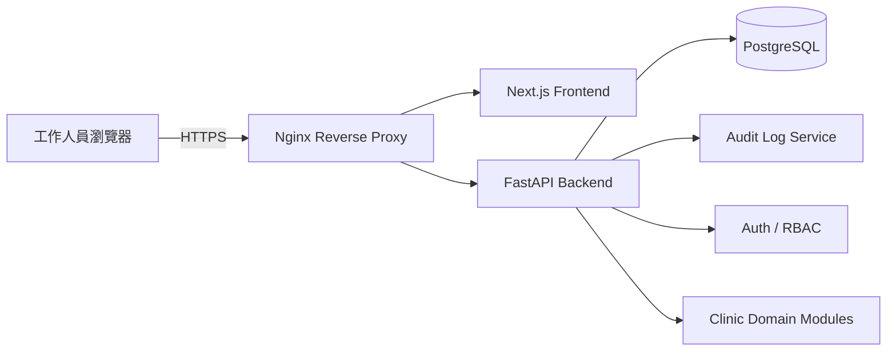
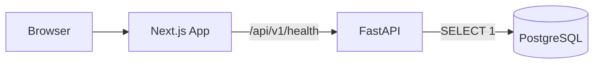

# 系統架構圖

## 架構原則

- 模組化單體後端，依 domain 拆分 router、service、repository、model、schema、permission、test。
- 前端以角色工作台為中心，不做行銷式首頁。
- 所有資料變更經由後端 API 與權限驗證。
- Nginx 負責部署時的 HTTPS 終止、靜態資源與 API 反向代理。
- PostgreSQL 使用 UUID 主鍵、外鍵、唯一限制、索引與 audit log。

## Phase 1 實作範圍

