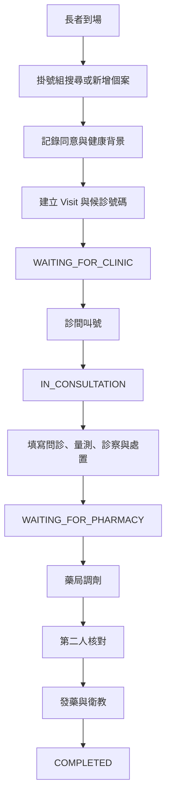
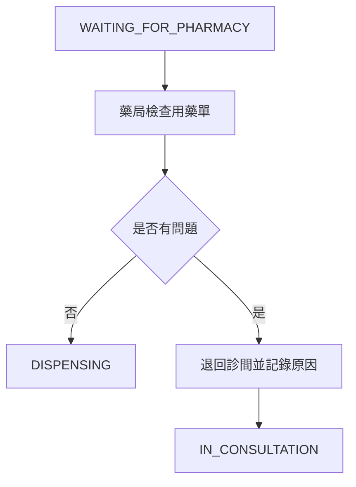

# 使用者流程圖

## 掛號到完成

```mermaid
flowchart TD
  A[長者到場] --> B[掛號組搜尋或新增個案]
  B --> C[記錄同意與健康背景]
  C --> D[建立 Visit 與候診號碼]
  D --> E[WAITING_FOR_CLINIC]
  E --> F[診間叫號]
  F --> G[IN_CONSULTATION]
  G --> H[填寫問診、量測、診察與處置]
  H --> I[WAITING_FOR_PHARMACY]
  I --> J[藥局調劑]
  J --> K[第二人核對]
  K --> L[發藥與衛教]
  L --> M[COMPLETED]
```

## 藥局退回

```mermaid
flowchart TD
  A[WAITING_FOR_PHARMACY] --> B[藥局檢查用藥單]
  B --> C{是否有問題}
  C -->|否| D[DISPENSING]
  C -->|是| E[退回診間並記錄原因]
  E --> F[IN_CONSULTATION]
```
