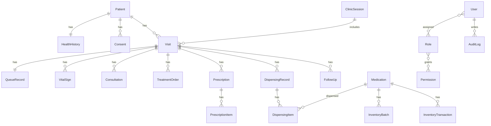

# ERD 與資料表設計

## 共通欄位

核心資料表使用 `UUID` 主鍵，並包含：

- `created_at`
- `updated_at`
- `created_by`
- `updated_by`
- `deleted_at` 或 `is_active`

## 主要唯一限制

- `users.username`
- `users.email`
- `patients.case_number`
- `clinic_sessions.name + date`
- `visits.clinic_session_id + patient_id`
- `queue_records.clinic_session_id + queue_number`
- `medications.code`
- `inventory_batches.medication_id + batch_number`

## 核心索引

- `visits.status`
- `visits.clinic_session_id, status`
- `audit_logs.actor_id, created_at`
- `audit_logs.patient_id, created_at`
- `inventory_batches.medication_id, expires_at`
