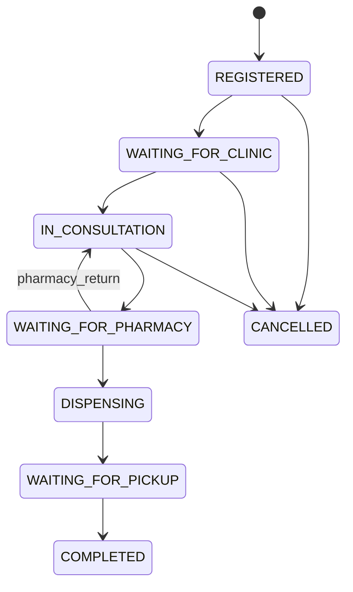

# 狀態機設計

## Visit 狀態

```mermaid
stateDiagram-v2
  [*] --> REGISTERED
  REGISTERED --> WAITING_FOR_CLINIC
  WAITING_FOR_CLINIC --> IN_CONSULTATION
  IN_CONSULTATION --> WAITING_FOR_PHARMACY
  WAITING_FOR_PHARMACY --> DISPENSING
  DISPENSING --> WAITING_FOR_PICKUP
  WAITING_FOR_PICKUP --> COMPLETED
  WAITING_FOR_PHARMACY --> IN_CONSULTATION: pharmacy_return
  REGISTERED --> CANCELLED
  WAITING_FOR_CLINIC --> CANCELLED
  IN_CONSULTATION --> CANCELLED
```

## 驗證規則

- 同一個個案不可在同一場次重複掛號。
- 藥局退回必須記錄原因。
- 發藥前必須完成第二人核對。
- 同一人不可同時為調劑者與第二核對者，除非管理員設定例外並寫入稽核。
- 完成發藥後才扣庫。
- 所有狀態轉換均需寫入 Audit Log。
